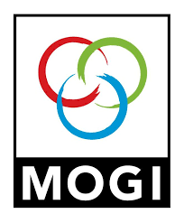
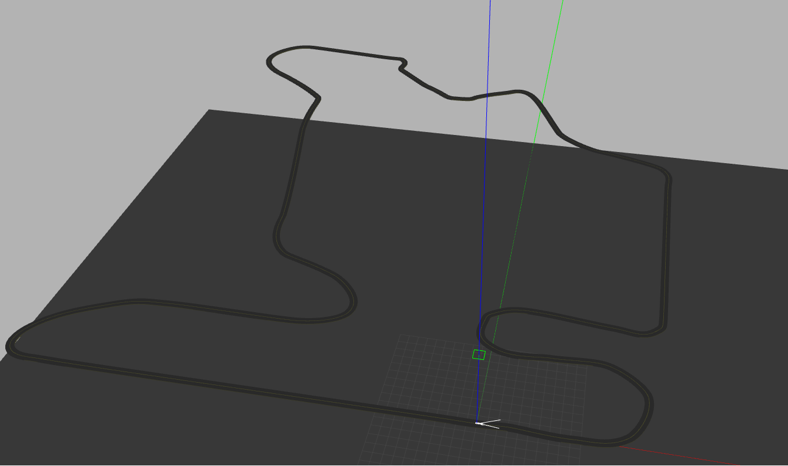
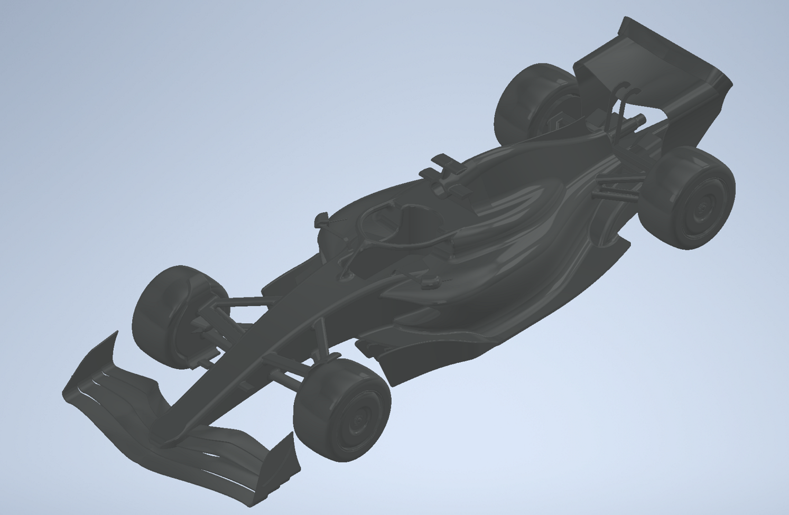
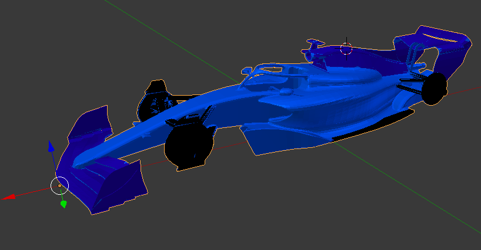

<div id="top"></div>


<!-- PROJECT LOGO -->
<br />
<div align="center">
  <a href="https://github.com/vargat99/Robotrendszerek-2021-22-2-Versenypalya">
    
  </a>

<h3 align="center">Robotrendszerek laboratórium 2021/22/2</h3>

</div>

# Versenyautó szimuláció a Hungaroringen

## Feladat ismertetése

A projekt feladat során ROS környezetben készítettünk el egy versenyautó szimulációt, ami önállóan tud haladni egy adott pályán, kamera kép alapján. Az adott versenypálya - közös megegyezés alaján - a Hungaroing lett.
## Megvalóstás

### Modellek létrehozása

Elsőként a versenypálya került létrehozásra. Kritikus szempont volt, hogy az út közepén egy - előre meghatározott színű - felező vonalat helyezzünk el, amit a kamera kép alapján követhet a vezrélés. A sávnak elég kontrasztosnak kellett lennie, hogy könnyen elkülöníthető legyen az aszfalttól és egyéb objektumoktól, így a sárga - RGB:... - színt választottuk.
 <div align="center">

</div>
Ezután a versenyautó modell építése következett. A versenyautó CAD modelljét a https://grabcad.com/library/f1-2022-car-1 honlapról töltöttük le. Ez egy Formula-1 2022 versenyautó általános modellje, ami egy vázból és 4 kerékből tevődik össze.
<div align="center">

</div>
Ezt a modellt Blender-ben alakítottuk át .stl -ről .dae típusra a könnyebb kezelhetőség miatt. KINEMATIKA??
TODO kinematika. 
A modell kinematikájának kialakítása után, a pályán való jobb követhetőség érdekében átszineztük a versenyautót.
Formula-1 2022 versenyautó általános modellje, ami egy vázból és 4 kerékből tevődik össze.
<div align="center">

</div>

### Kamera beállítás

TODO

A navigáláshoz egy az autón elhelyezett kamera képét dolgoztuk fel az OpenCV könyvtár segítségével. Ezenkívül egy versenypályát is létrehoztunk
  
### Vezérlés összehasonlítás - Köridők

Az elkészült modell után, a megfelelő vezérlés fejlesztése  következett, a cél: leggyorsabb köridő elérése. Több vezérlést teszteltünk, ezeket tartalmazza a következő táblázat:
 
| Órai vezérlés körideje  | P vezérlés körideje |
| ------------- | ------------- |
| DNF  | 5:00  |
 
 A legrosszabb eredményt az órán használt egyszerű vezérléssel tette meg a versenyautó: élesebb kanyarokban elakadt. A legjobb eredményt a TODO vezérléssel érte el:.
 
 ### Összefoglalás

## Telepítési útmatató
A projekt telepítése az alábbi lépésekből tevődik össze:
* TODO
   ```sh
   git clone https://github.com/TODO
   ```


