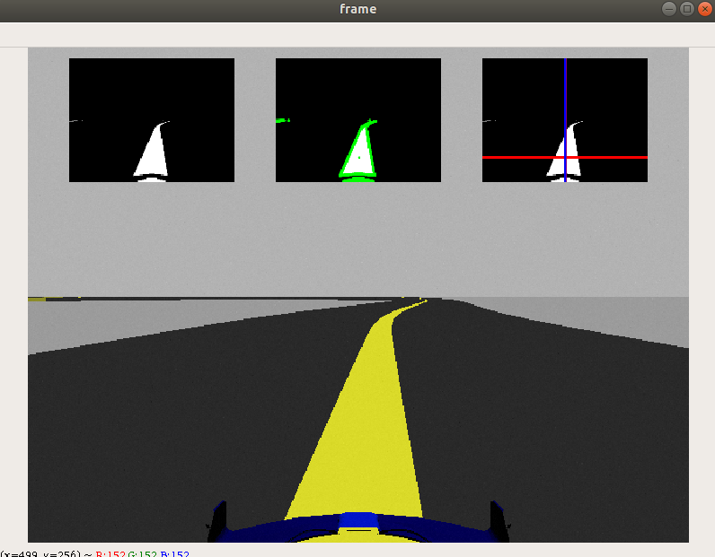
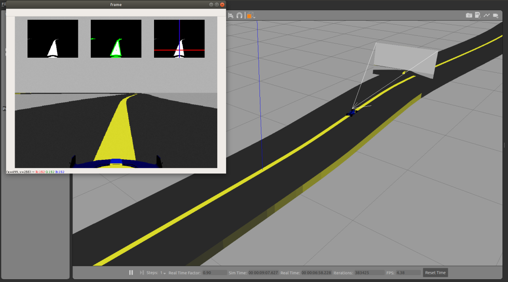

<div id="top"></div>


<!-- PROJECT LOGO -->
<br />
<div align="center">
  <a href="https://github.com/vargat99/Robotrendszerek-2021-22-2-Versenypalya">
    
  </a>

<h3 align="center">Robotrendszerek laboratórium 2021/22/2</h3>

</div>

# Versenyautó szimuláció a Hungaroringen

## Tartalomjegyzék
- [Feladat ismertetése](#Feladat-ismertetése)
- [Megvalósítás](#heading-1)
  * [Modellek létrehozása](#sub-heading-1)
  * [Kamera beállítás](#sub-heading-1)
  * [Vezérlés összehasonlítás - Köridők](#sub-heading-1)
- [Eredmények](#heading-2)
- [Telepítési útmutató](#heading-2)

## Feladat ismertetése

A projekt feladat során ROS környezetben készítettünk el egy versenyautó szimulációt, ami önállóan tud haladni egy adott pályán, kamera kép alapján. Az adott versenypálya - közös megegyezés alaján - a Hungaroing lett.
## Megvalósítás

### Modellek létrehozása

Elsőként a versenypálya került létrehozásra. Kritikus szempont volt, hogy az út közepén egy - előre meghatározott színű - felező vonalat helyezzünk el, amit a kamera kép alapján követhet a vezrélés. A sávnak elég kontrasztosnak kellett lennie, hogy könnyen elkülöníthető legyen az aszfalttól és egyéb objektumoktól, így a sárga színt választottuk.
 <div align="center">

</div>
Ezután a versenyautó modell építése következett. A versenyautó CAD modelljét a https://grabcad.com/library/f1-2022-car-1 honlapról töltöttük le. Ez egy Formula-1 2022 versenyautó általános modellje, ami egy vázból és 4 kerékből tevődik össze.

<div align="center">

</div>

Ezt a modellt Blender-ben alakítottuk át .stl -ről .dae típusra a könnyebb kezelhetőség miatt. A kinematika felépítése:
* Base_footprint
* Base_link
* Camera_link
* Camera_link_optical
* imu_link
* Front_left
* Front_right
* Rear_left
* Rear_right
* odom
 
A modell kinematikájának kialakítása után, a pályán való jobb követhetőség érdekében átszineztük a versenyautót.
Formula-1 2022 versenyautó általános modellje, ami egy vázból és 4 kerékből tevődik össze.
<div align="center">

</div>

Ellentétben az elterjedt versenyautók felépítésével itt mind a 4 kereket hajtjuk (összkerékhajtásos).

### Kamera beállítás

A vonalkövetési feladathoz RGB kamerát használ a modell. Ezt a versenyautó tetéjén lévő "Halo"-hoz fix joint-tal rendeltük hozzá. A következő ábra mutatja be az autó által látott majd feldolgozott képet, a feldolgozáshoz OpenCV könyvtárat használtunk.
<div align="center">

</div>
A navigáláshoz egy az autón elhelyezett kamera képét dolgoztuk fel az OpenCV könyvtár segítségével. Ezenkívül egy versenypályát is létrehoztunk
  
### Vezérlés összehasonlítás - Köridők

Az elkészült modell után, a megfelelő vezérlés fejlesztése  következett, a cél: leggyorsabb köridő elérése. Több vezérlést teszteltünk, ezeket tartalmazza a következő táblázat:
 
| Órai vezérlés körideje  | P vezérlés körideje |PID vezérlés körideje | (Pályarekord F1)|
| ------------- | ------------- | ------------- | ------------- |
| DNF  |1:30:00 <  | 1:15:00 <  | 1:13.447 |
 
 A legrosszabb eredményt az órán használt egyszerű vezérléssel tette meg a versenyautó: élesebb kanyarokban elakadt / leesett a pályáról. A legjobb eredményt a PID vezérléssel érte el, látványosan gyorsabban haladt a pályán mint a sima P szabályozással.
 
 ## Eredmény
 
 A végső modell képes a versenypálya közepén elhelyezett sárga vonalat - kamera kép alapján - követni, így képes több kört megtenni a pályán.
 
<div align="center">

</div>

A projekt futásáról elérhető youtube video:

<div align="center">
A videó az alábbi linken tekinthető meg: https://youtu.be/oDQp8RPedYw
</div>

## Telepítési útmatató
A projekt telepítése az alábbi lépésekből tevődik össze:
* Git repo letöltése / klónozása
   ```sh
   git clone https://github.com/TODO](https://github.com/vargat99/Robotrendszerek-2021-22-2-Versenypalya.git
   ```
* A hungaroring5.world fájl elérése abszolút hivatkozás alapú, így ezt módosítani kell a track.dae fájl mentési helyére: (113. és 126. sor)

   ```sh
  <uri>/home/catkin_ws/src/Robotrendszerek-2021-22-2-Versenypalya-main/versenypalya/meshes/hungaroring/meshes/track.dae</uri>
   ```
   
* Launch fájl indítása

   ```sh
   roslaunch versenypalya spawn_robot.launch 
   ```
   
* A megfelelő vezérlés elindítása: line_follower_P.py vagy line_follower_PID.py

   ```sh
   rosrun versenypalya line_follower_P.py
   ``` 
   
* A projekt Python3-ban készült, ha korábbi verziók egyikével futtatná, akkor a "line_follower_P/PID" függvény első sorát kell módosítani.


